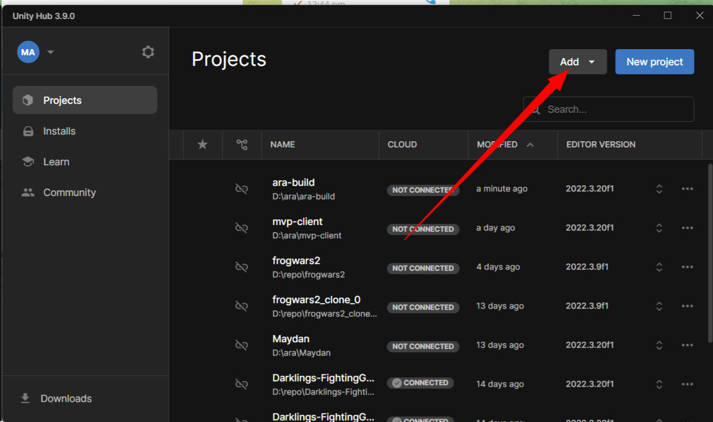
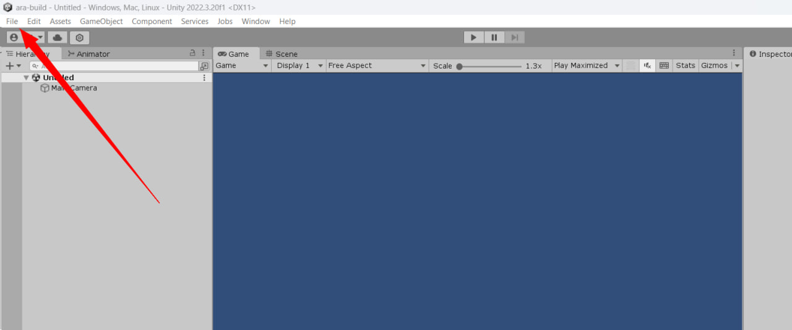
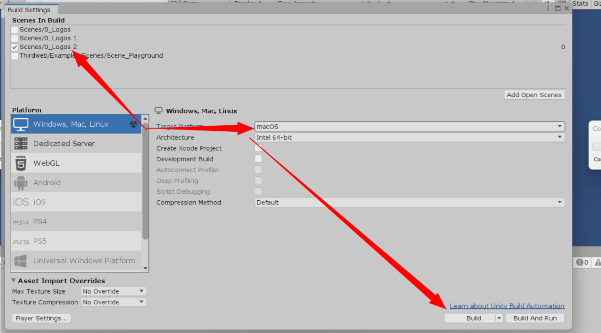

# Ara Comilation

Instructions to build Ara Client:

1. Clone the repository on gitlab. https://gitlab.com/ara-foundation/ara-client#  
     Requires to sign up using pak@ara.foundation
2. Download the Unity Hub.
3. Sign up on Unity and login into Unity Hub using your ara email: pak@ara.foundation
4. Open the cloned repository on unity hub:
5. Open the project. (if required, download the unity editor)

*From Add list, select the cloned repository's directory: Pick the project from disk*

**For first time, when opening the project, it will take a while until Unity builds the links. So be patient.**

6. If when you open the client, there is error, then close the client and open the project from unity hub again. The error occurs when Unity fails to cache the build files

7. Open the "File" -> "Build Settings..."

8. Prepare the build plan:

a) make sure you selected only the "Scenes/0_Logos_2" scene. All others are not necessary.
b. In the Platform, Select "Windows, Mac, Linux". And switch the platform here. To Mac
c) Wait until the Unity loads the Mac parameters.
d) Finally, click on "Build" to build the Unity App.

9. Upload the game to the telegram.
## Credits

### WormHole for Ara Frontend's Input button
Model Information:
* title:	Wormhole Concept
* source:	https://sketchfab.com/3d-models/wormhole-concept-33b7ab81fc1d4d6e8310bad1567b96da
* author:	James Truhlar (https://sketchfab.com/mdcrtv)

Model License:
* license type:	CC-BY-4.0 (http://creativecommons.org/licenses/by/4.0/)
* requirements:	Author must be credited. Commercial use is allowed.

If you use this 3D model in your project be sure to copy paste this credit wherever you share it:
This work is based on "Wormhole Concept" (https://sketchfab.com/3d-models/wormhole-concept-33b7ab81fc1d4d6e8310bad1567b96da) by James Truhlar (https://sketchfab.com/mdcrtv) licensed under CC-BY-4.0 (http://creativecommons.org/licenses/by/4.0/)

### Burst for Ara Frontend's Output button
Model Information:
* title:	Burst
* source:	https://sketchfab.com/3d-models/burst-79ada2c9baac41f88d2cfa4d8b29b29f
* author:	John.Dee2 (https://sketchfab.com/John.Dee2)

Model License:
* license type:	CC-BY-4.0 (http://creativecommons.org/licenses/by/4.0/)
* requirements:	Author must be credited. Commercial use is allowed.

If you use this 3D model in your project be sure to copy paste this credit wherever you share it:
This work is based on "Burst" (https://sketchfab.com/3d-models/burst-79ada2c9baac41f88d2cfa4d8b29b29f) by John.Dee2 (https://sketchfab.com/John.Dee2) licensed under CC-BY-4.0 (http://creativecommons.org/licenses/by/4.0/)

### Minion for ACT Part's Task button
"Minion" (https://skfb.ly/69wDN) by WelsEvil is licensed under Creative Commons Attribution-NonCommercial (http://creativecommons.org/licenses/by-nc/4.0/).